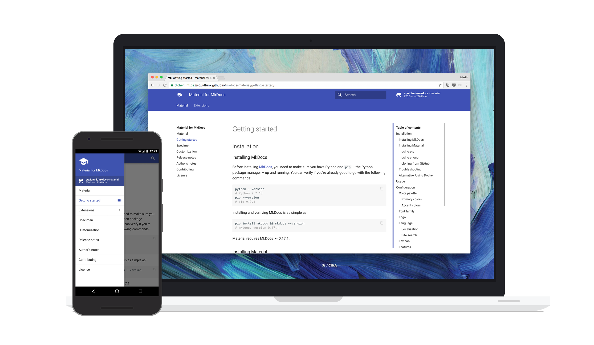

# Setting Up A Local Environment <small>for EOSIO</small>

---

## Window

* Setting up a Virtual Machine and [EOSIO dawn3][1], [ubuntu iso][2]

* [EOS.IO development on window][3] (ubuntu on window)

## Ubuntu 16.04

* [Manual installation][4] of the dependencies:

* [Build EOS][5] and run a node:

## MacOS

* [Manual installation][6] of the dependencies:

* [Build EOS][7] and run a node:

## Docker

* [For running docker][8]

## Test Development enviroment

* [Test Development enviroment][9]

---

  [1]: https://www.youtube.com/watch?v=glB6UPHo1rA
  [2]: http://releases.ubuntu.com/16.04.4/
  [3]: https://goo.gl/SmRHWR
  [4]: https://github.com/EOSIO/eos/wiki/Local-Environment#manualdepubuntu
  [5]: https://github.com/EOSIO/eos/wiki/Local-Environment#2-building-eosio
  [6]: https://github.com/EOSIO/eos/wiki/Local-Environment#manualdepmacos
  [7]: https://github.com/EOSIO/eos/wiki/Local-Environment#2-building-eosio
  [8]: https://github.com/EOSIO/eos/wiki/Local-Environment#3-docker
  [9]: https://github.com/EOSIO/eos/wiki/Tutorial-Getting-Started-With-Contracts

